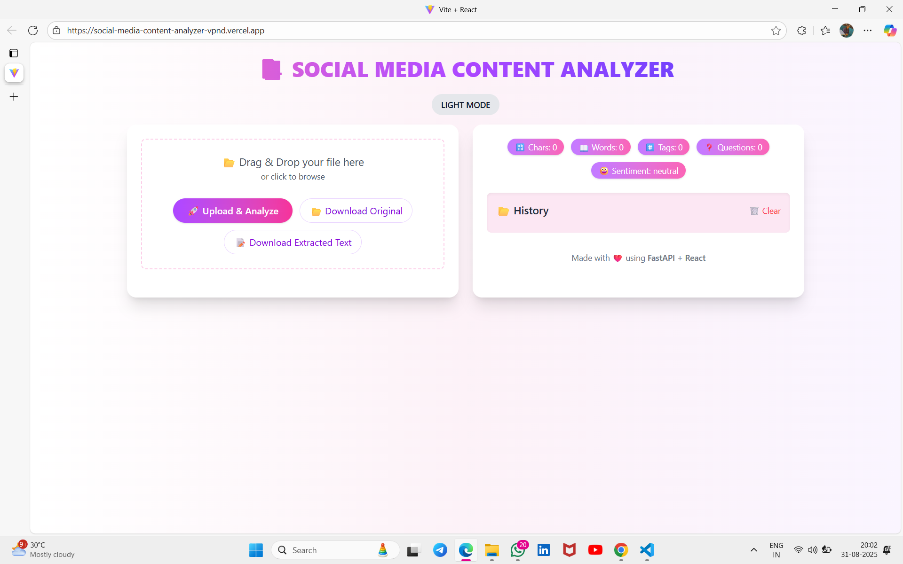
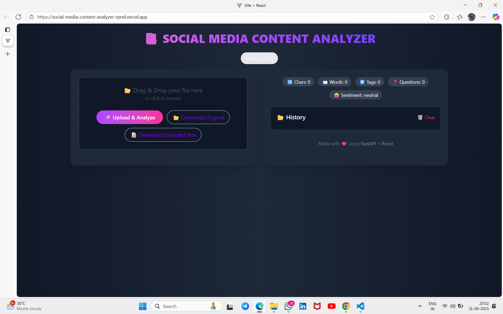
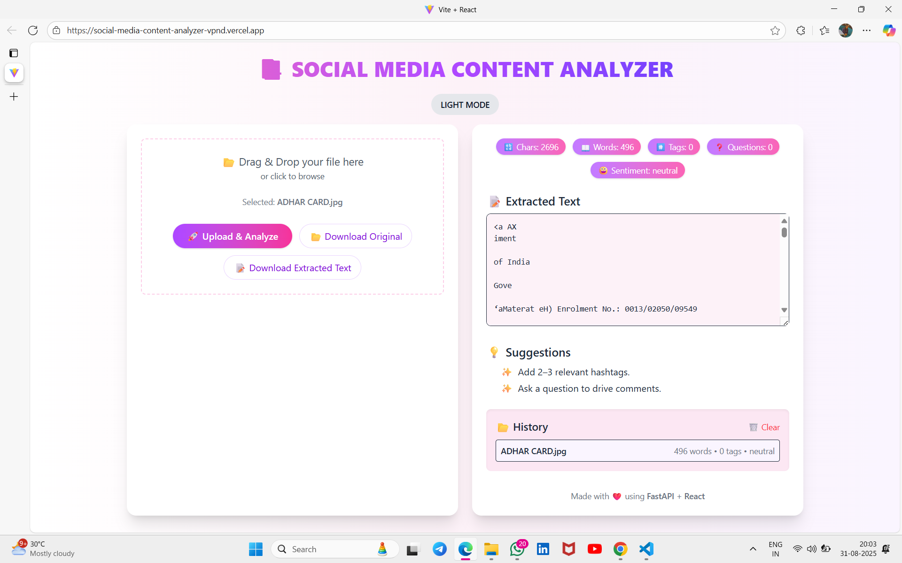
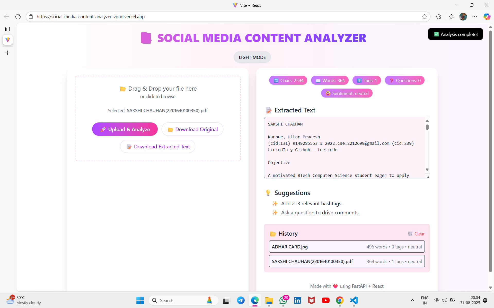

📑 Social Media Content Analyzer

🔗 Deliverables
    🚀 Working Application URL (Vercel)
        🔗 https://social-media-content-analyzer-vpnd.vercel.app

    📂 GitHub Repository
        🔗 https://github.com/SakshiChauhan713/social-media-content-analyzer

🚀 Project Overview

The Social Media Content Analyzer is a web application that allows users to upload PDF and image files (e.g., scanned documents). The system extracts text from these files using PDF parsing and OCR (Optical Character Recognition), and then performs content analysis to provide insights and suggestions for better engagement.

It is designed with a clean UI, supports both light & dark themes, and provides additional features like text statistics, sentiment analysis, history management, and one-click downloads.

📂 Project Structure
social-media-content-analyzer/
│
├── backend/                 # FastAPI backend for  
| extraction & analysis
│   ├── main.py              # FastAPI app entry  
| point
│   ├── requirements.txt     # Backend dependencies
│   └── ...  
│
├── frontend/
|    ├── src/                     # React frontend
| (Vite + Tailwind CSS)
│   ├── App.jsx              # Main application  
| component
│   ├── assets/              # Images/icons
│   ├── components/          # UI components
│   ├── index.css            # Global styles
│   └── main.jsx             # React app entry point
│                  # Public static assets
│
├── package.json             # Frontend dependencies
├── tailwind.config.js       # Tailwind configuration
├── vite.config.js           # Vite configuration
└── README.md                # Project documentation

🛠️ Tech Stack
Frontend → React + Vite + TailwindCSS
Backend → FastAPI (Python)
OCR → Tesseract OCR
Deployment → Vercel (Frontend) + FastAPI on Railway (Backend)

⚙️ Setup Instructions
1️⃣ Clone Repository
git clone https://github.com/your-username/social-media-content-analyzer.git
cd social-media-content-analyzer

2️⃣ Setup Backend (FastAPI)
cd backend
pip install -r requirements.txt
uvicorn main:app --reload
Backend will run on → http://127.0.0.1:8000

3️⃣ Setup Frontend (React + Vite)
cd frontend
npm install
npm run dev

⚙️ Features
📂 File Upload → Upload PDF and Image files via drag-and-drop or file picker.
🔍 Text Extraction → Uses PDF parsing & OCR for scanned images.
📊 Content Analysis → Counts characters, words, hashtags, questions, and performs sentiment analysis.
💡 Suggestions → Provides improvement tips for engagement.
🌙 Dark/Light Mode → User-friendly theming.
📝 Download Options → Download extracted text or JSON report.
🧹 History Management → Maintains past uploads with option to clear.
📋 Copy to Clipboard → One-click copy of extracted text.

📸 Screenshots  

🖊️ Approach
The project was developed using React (Vite) for the frontend and FastAPI for the backend, with a focus on clean, production-quality code and a simple user-friendly interface.

The Document Upload Module supports both drag-and-drop and file picker options. Once a document is uploaded, the backend determines whether it is a PDF or an image. For PDFs, text is extracted using parsing libraries, while for images, OCR (Optical Character Recognition) with Tesseract is used to recognize and extract text from scanned documents.

The extracted text is then analyzed in the Analysis Module, which computes:
Character and word count
Number of hashtags
Number of questions
Overall sentiment analysis
Based on the results, actionable suggestions are generated to help improve engagement.

The frontend UI was built with React + TailwindCSS, providing a responsive design with dark/light mode support. React hooks manage state, while LocalStorage persists history and user preferences. Extra usability features include copy to clipboard, download extracted text/report, and history tracking.

For deployment, the frontend was hosted on Vercel, while the backend was deployed using Railway. This ensured a smooth end-to-end workflow with scalability.

The project also implements loading states, error handling, and toast notifications, delivering a polished and reliable user experience.

👩‍💻 Author
Sakshi Chauhan
📧 [2022.cse.2212699@gmail.com](mailto:2022.cse.2212699@gmail.com)  
🔗 [GitHub Profile](https://github.com/SakshiChauhan713)
